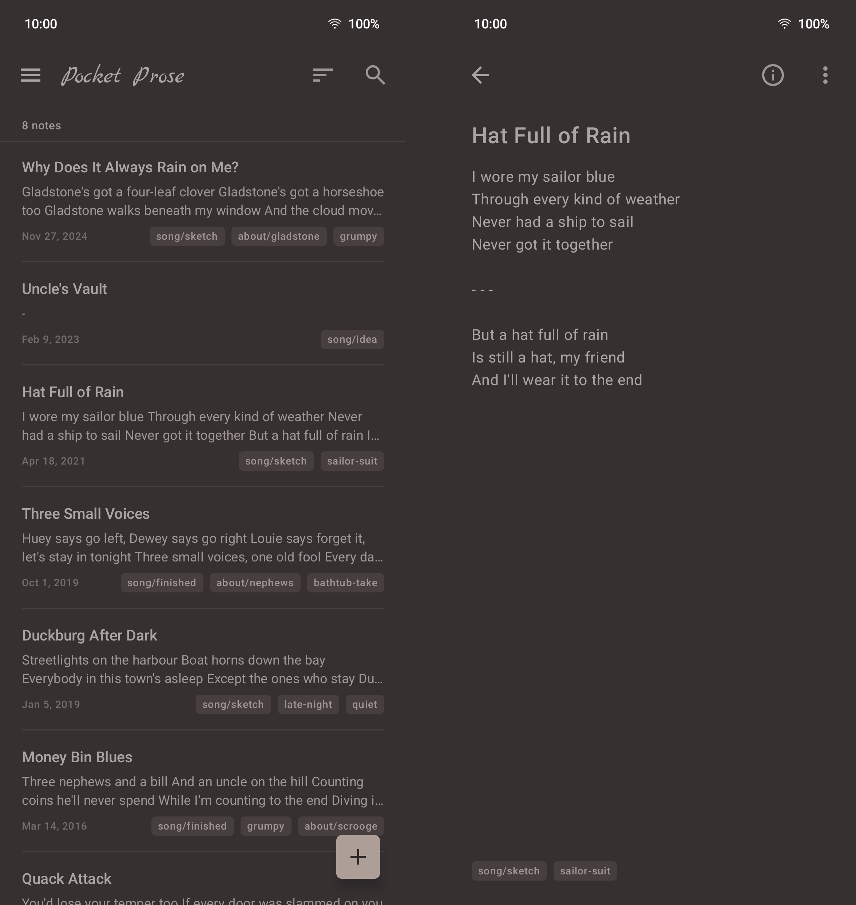

<h1>
  
  Pocket Prose
</h1>

**Write, keep, capture inspiration.**

A writing app for Android that uses markdown and reads a folder. Point it at a directory full of `.md` files or start building your notebook from scratch. It uses the system file picker, so it needs no storage permission of its own - and it lists, reads, edits and searches them in place. The files stay the database. Uninstall it and the folder is byte-identical to how it found it, apart from edits you actually made.

Built for a personal prose and lyrics archive of ~ 200 notes over years, which is why it is opinionated about leaving things alone.

## Screenshots



## What it does not do

This is the short list, and it is the point of the app rather than a set of missing features:

- No renaming files to match their titles or headings, no injecting IDs or app-owned keys into frontmatter, no rewriting frontmatter it did not itself change.
- No importing into an internal database. No required subfolder layout, naming scheme, or index file.
- No auto-deleting a note because a file vanished, and no auto-merging when one changes underneath it — a synced folder does that. Conflicts are surfaced, never resolved for you.
- No cloud account, no telemetry, no network permission.

## What it does

- **Titles from frontmatter**, never derived from the filename — the two often differ, and duplicate titles across files stay separate notes.
- **A tag tree** built from `/` path segments, read from the frontmatter `tags:` list and nothing else — `F#` in a lyric is a sharp, and a `#hashtag` in a body is text. A folder that still keeps its tags and titles in the body gets a one-time offer to move them into the frontmatter, and the zip export can write them back.
- **Pinned notes**, by tag. Notes carrying the pin tag — `pinned` unless you rename it — sit at the top of the library, whatever the sort. It is an ordinary tag in every other way, so it syncs with the note and survives the app; a flag stored anywhere else would not.
- **Relative images and attachments**, resolved against the note's own folder, so `` renders and a linked PDF opens in an external viewer.
- **Scratch lines.** A line beginning with `+` glued to the text — `+an alternative line`, `+a comment` — is shown dimmed while writing (the format bar's crossed-out eye puts the `+` on the selected lines), and the eye button in the note's bar reads the note without those lines. `+ word` with a space is a bullet, as in CommonMark; the glued form is plain text everywhere else, and the app never adds or removes one.
- **A plain editor** for ordinary Markdown. Selecting text brings up a small strip of its own — bold, italic, quotes, clipboard — and a source view shows the note with nothing hidden.
- **Dates from the file**, not from when the app first saw it — and the library sorts by them, created or last changed.
- **Text shared from another app** becomes a new note; the launcher icon's long-press menu offers New note and Search.
- **Atomic writes** — temp file plus rename, so a sync client never sees a half-written note.

## Building

Requires a JDK (17+) and the Android SDK. Point the build at your SDK with a git-ignored `local.properties` in the project root:

```properties
sdk.dir=/path/to/Android/Sdk
```

Then:

```sh
./gradlew assembleDebug
```

The APK lands at `app/build/outputs/apk/debug/app-debug.apk`.

## License

GPL-3.0-**only** — version 3 of the GNU General Public License, and not "or any later version". The full text is in [LICENSE](LICENSE), the copyright notice in [COPYRIGHT](COPYRIGHT).

### Artwork and name

The icon and the wordmark are licensed separately, under **CC BY 4.0**. [COPYRIGHT](COPYRIGHT) lists the files. Their editable sources live beside this repository rather than in it, so a clone can use and modify the exported drawables but cannot re-export them.

The **name** is not licensed by either grant — give a fork its own.

Notes can be set in **Literata** (© 2017 The Literata Project Authors) or **EB Garamond** (© 2017 The EB Garamond Project Authors), both bundled under the **SIL Open Font License 1.1** — [Literata](licenses/Literata-OFL.txt), [EB Garamond](licenses/EBGaramond-OFL.txt). Both are static instances cut from the upstream variable fonts and subset to Latin; `COPYRIGHT` says exactly how.

## Disclaimer

This project was developed with the assistance of Claude, under my direction and functional review.
